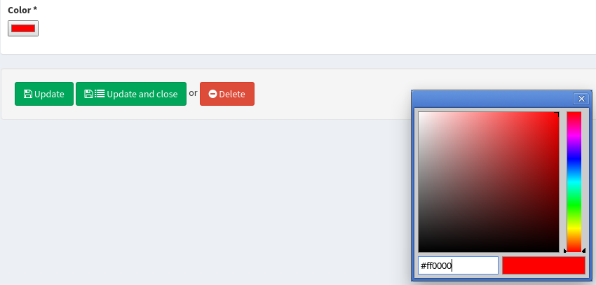

.. index::
    double: Form Type; Definition

Form Types
==========

The bundle comes with some handy form types.

DoctrineORMSerializationType
----------------------------

This form type reads ``JMSSerializer`` serialization class metadata and uses ``Doctrine`` ORM entity metadata to generate form fields and correct types.

All you have to do is to define a form type service for each entity for which you want to use a form type, like this:

.. configuration-block::

    .. code-block:: xml

        <service id="my.custom.form.type.comment" class="Sonata\CoreBundle\Form\Type\DoctrineORMSerializationType">
            <tag name="form.type" alias="my_custom_form_type_comment" />

            <argument type="service" id="jms_serializer.metadata_factory" />
            <argument type="service" id="doctrine" />
            <argument>my_custom_form_type_comment</argument>
            <argument>AppBundle\Entity\Comment</argument>
            <argument>a_serialization_group</argument>
        </service>

The service definition should contain the following arguments:

* The JMSSerializer metadata factory,
* The Doctrine ORM entity manager,
* The form type name,
* The entity class name for which you want to build form,
* The serialization group you want serialization fields have.

.. warning::

    ``DoctrineORMSerializationType`` cannot be used directly with
    Symfony3.0, you need to extend the class
    ``BaseDoctrineORMSerializationType`` with an empty class to have a
    unique FQCN.

ImmutableArrayType
------------------

The ``Immutable Array`` allows you to edit an array property by defining a type per key.

The type has a ``keys`` parameter which contains the definition for each key.
A definition is either a ``FormBuilder`` instance or an array with 3 options:

* key name,
* type: a type name or a ``FormType`` instance,
* related type parameters: please refer to the related form documentation.

Let's say a ``Page`` has options property with some fixed key-value pairs.
Each value has a different type: `integer`, `url`, or `string` for instance.

.. code-block:: php

    <?php
    // src/AppBundle/Entity/Page.php

    class Page
    {
        protected $options = array(
            'ttl'       => 1,
            'redirect'  => ''
        );

        public function setOptions(array $options)
        {
            $this->options = $options;
        }

        public function getOptions()
        {
            return $this->options;
        }
    }

Now, the property can be edited by setting a type for each type:

.. code-block:: php

    <?php
    // src/AppBundle/Admin/PageAdmin.php
    use Sonata\CoreBundle\Form\Type\ImmutableArrayType;

    class PageAdmin extends Admin
    {
        protected function configureFormFields(FormMapper $formMapper)
        {
            $formMapper
                ->add('options', ImmutableArrayType::class, array(
                    'keys' => array(
                        array('ttl', 'text', array('required' => false)),
                        array('redirect', 'url', array('required' => true)),
                    )
                ))
                // ...
            ;
        }

        // ...
    }

BooleanType
-----------

The ``boolean`` type is a specialized ``ChoiceType``, where the list of choices is locked to *yes* and *no*.

Note that for backward compatibility reasons, it will set your value to *1* for *yes* and to *2* for *no*.
If you want to map to a boolean value, just set the option ``transform`` to true. For instance, you need to do so when mapping to a doctrine boolean.

TranslatableChoiceType
----------------------

The translatable type is a specialized ``ChoiceType`` where the choices values are translated with the Symfony Translator component.

The type has one extra parameter:

 * ``catalogue``: the catalogue name to translate the value.

.. code-block:: php

    <?php
    // src/AppBundle/Entity/Delivery.php

    class Delivery
    {
        public static function getStatusList()
        {
            return array(
                self::STATUS_OPEN      => 'status_open',
                self::STATUS_PENDING   => 'status_pending',
                self::STATUS_VALIDATED => 'status_validated',
                self::STATUS_CANCELLED => 'status_cancelled',
                self::STATUS_ERROR     => 'status_error',
                self::STATUS_STOPPED   => 'status_stopped',
            );
        }

        // ...
    }

.. code-block:: php

    <?php
    // src/AppBundle/Admin/DeliveryAdmin.php
    use Sonata\CoreBundle\Form\Type\TranslatableChoiceType;

    class DeliveryAdmin extends Admin
    {
        protected function configureFormFields(FormMapper $formMapper)
        {
            $formMapper
                ->add('deliveryStatus', TranslatableChoiceType::class, array(
                    'choices' => Delivery::getStatusList(),
                    'catalogue' => 'SonataOrderBundle'
                ))
                // ...
            ;
        }

        // ...
    }

.. note::

    For more information, you can check the official `ChoiceType documentation`_ .

CollectionType
--------------

The ``Collection Type`` is meant to handle creation and editing of model
collections. Rows can be added and deleted, and your model abstraction layer may
allow you to edit fields inline. You can use ``type_options`` to pass values
to the underlying forms.

.. code-block:: php

    <?php
    // src/AppBundle/Entity/ProductAdmin.php
    use Sonata\CoreBundle\Form\Type\CollectionType;

    class ProductAdmin extends Admin
    {
        protected function configureFormFields(FormMapper $formMapper)
        {
            $formMapper
                ->add('sales', CollectionType::class, array(

                    // Prevents the "Delete" option from being displayed
                    'type_options' => array('delete' => false)
                ), array(
                    'edit' => 'inline',
                    'inline' => 'table',
                    'sortable' => 'position',
                ))
                // ...
            ;
        }

        // ...
    }

The available options (which can be passed as a third parameter to ``FormMapper::add()``) are:

btn_add and btn_catalogue:
  The label on the ``add`` button can be customized
  with this parameters. Setting it to ``false`` will hide the
  corresponding button. You can also specify a custom translation catalogue
  for this label, which defaults to ``SonataAdminBundle``.

type_options:
  This array is passed to the underlying forms.

pre_bind_data_callback:
  This closure will be executed during the preBind method (``FormEvent::PRE_BIND`` | ``FormEvent::PRE_SUBMIT``)
  to build the data given to the form based on the value retrieved. Use this if you need to generate your forms based
  on the submitted data.

**TIP**: A jQuery event is fired after a row has been added (``sonata-admin-append-form-element``).
You can listen to this event to trigger custom javascript (eg: add a calendar widget to a newly added date field)

StatusType
----------

The ``StatusType`` is not available as a service. However, you can use it to declare your own type to render a choice of status.

Let's say, you have a ``Delivery::getStatusList`` method which returns a list of status. Now, you want to create a form type to expose those values.

.. code-block:: php

    <?php
    // src/AppBundle/Entity/Delivery.php

    class Delivery
    {
        public static function getStatusList()
        {
            return array(
                self::STATUS_OPEN      => 'status_open',
                self::STATUS_PENDING   => 'status_pending',
                self::STATUS_VALIDATED => 'status_validated',
                self::STATUS_CANCELLED => 'status_cancelled',
                self::STATUS_ERROR     => 'status_error',
                self::STATUS_STOPPED   => 'status_stopped',
            );
        }
    }

This can be done by declaring a new service:

.. configuration-block::

    .. code-block:: xml

        <service id="sonata.order.form.status_type" class="Sonata\CoreBundle\Form\Type\StatusType">
            <tag name="form.type" />

            <argument>%sonata.order.order.class%</argument>
            <argument>getStatusList</argument>
            <argument>sonata_order_status</argument>
        </service>

And the type can now be used:

.. code-block:: php

    <?php
    // src/AppBundle/Admin/DeliveryAdmin.php
    use App\Type\OrderStatusType;

    class DeliveryAdmin extends Admin
    {
        protected function configureFormFields(FormMapper $formMapper)
        {
            $formMapper
                ->add('deliveryStatus', OrderStatusType::class)
                // ...
            ;
        }
    }

.. warning::

    ``StatusType`` cannot be used directly with Symfony3.0, you need to
    extend the class ``BaseStatusType`` with an empty class to have a
    unique FQCN.

DatePickerType and DateTimePickerType
-------------------------------------

Those types integrate `Eonasdan's Bootstrap datetimepicker`_ into a
Symfony form. They both are available as services and inherit from
``date`` and ``datetime`` default form types.

.. note::

    These form types require you to have bootstrap and jquery assets available in your project.

They will allow you to have a JS date picker onto your form fields as follows:

.. image:: ../images/datepicker.png

In order to use them, you'll need to perform a bit of setup:

.. configuration-block::

    .. code-block:: yaml

        # app/config/config.yml

        twig:
            form_themes:
                - '@SonataCore/Form/datepicker.html.twig'

In your layout, you'll need to add the assets dependencies (feel free to
adapt this to your needs, for instance, to use with assetic):

.. code-block:: html

    <head>
        <!-- ... -->
        
        
        
        
        <link rel="stylesheet" href="path_to_bootstrap.min.css" />
        <link rel="stylesheet" href="/bundles/sonatacore/vendor/eonasdan-bootstrap-datetimepicker/build/css/bootstrap-datetimepicker.min.css" />
    </head>

Finally, in your form, you may use the form type as follows:

.. code-block:: php

    <?php
    // src/AppBundle/Admin/PageAdmin.php
    use Sonata\CoreBundle\Form\Type\DatePickerType;
    use Sonata\CoreBundle\Form\Type\DateTimePickerType;

    class PageAdmin extends Admin
    {
        protected function configureFormFields(FormMapper $formMapper)
        {
            $formMapper
                ->add('publicationDateStart', DateTimePickerType::class)

                // or sonata_type_date_picker if you don't need the time
                ->add('publicationDateStart', DatePickerType::class)

                // ...
            ;
        }
    }

Many of the `standard date picker options`_ are available by adding options with a ``dp_`` prefix:

.. code-block:: php

    <?php
    // src/AppBundle/Admin/PageAdmin.php
    use Sonata\CoreBundle\Form\Type\DatePickerType;
    use Sonata\CoreBundle\Form\Type\DateTimePickerType;

    class PageAdmin extends Admin
    {
        protected function configureFormFields(FormMapper $formMapper)
        {
            $formMapper
                ->add('publicationDateStart', DateTimePickerType::class, array(
                        'dp_side_by_side'       => true,
                        'dp_use_current'        => false,
                        'dp_use_seconds'        => false,
                        'dp_collapse'           => true,
                        'dp_calendar_weeks'     => false,
                        'dp_view_mode'          => 'days',
                        'dp_min_view_mode'      => 'days',
                ))

                // or sonata_type_date_picker if you don't need the time
                ->add('publicationDateStart', DatePickerType::class, array(
                        'dp_use_current'        => false,
                ))
            ;
        }
    }

If you look in the classes ``DateTimePickerType.php`` and ``BasePickerType.php`` you can see all the currently available options.

In addition to these standard options, there is also the option ``datepicker_use_button`` which, when used, will change the widget so that the datepicker icon is not shown and the pop-up datepicker is invoked simply by clicking on the date input.

DateRangePickerType and DateTimeRangePickerType
-----------------------------------------------

Those types extend the basic range form field types
(``Sonata\CoreBundle\Form\Type\DateRangeType`` and
``Sonata\CoreBundle\Form\Type\DateTimeRangeType``).
You can use them if you need datetime picker in datetime range filters.

Example with ``Sonata\DoctrineORMAdminBundle\Filter\DateRangeFilter`` filter:

.. code-block:: php

    <?php
    // src/AppBundle/Admin/PostAdmin.php
    use Sonata\CoreBundle\Form\Type\DateRangeType;
    use Sonata\DoctrineORMAdminBundle\Filter\DateRangeFilter;

    class PostAdmin extends Admin
    {
        protected function configureDatagridFilters(DatagridMapper $datagridMapper)
        {

            $datagridMapper
                ->add('createdAt', DateRangeFilter::class, array(
                    'field_type' => DateRangeType::class,
                ))
                // ...
            ;
        }

        // ...
    }

ColorType
---------

This is HTML5 input type color.

In order to use it, you'll need to perform a bit of setup:

.. configuration-block::

    .. code-block:: yaml

        # app/config/config.yml
        twig:
            form_themes:
                - '@SonataCore/Form/color.html.twig'

Finally, in your form, you may use the form type as follows:

.. code-block:: php

    <?php
    // src/AppBundle/Admin/PageAdmin.php
    use Sonata\CoreBundle\Form\Type\ColorType;

    class PageAdmin extends Admin
    {
        protected function configureFormFields(FormMapper $formMapper)
        {
            $formMapper
                ->add('color', ColorType::class)
                // ...
            ;
        }

        // ...
    }

.. _`ChoiceType documentation`: http://symfony.com/doc/current/reference/forms/types/choice.html
.. _`Eonasdan's Bootstrap datetimepicker`: https://github.com/Eonasdan/bootstrap-datetimepicker
.. _`standard date picker options`: http://eonasdan.github.io/bootstrap-datetimepicker/#options
